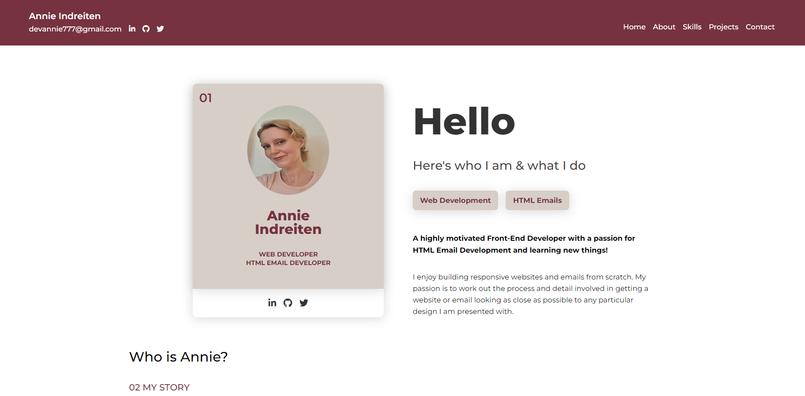

## Table of contents

- [Overview](#overview)
  - [The challenge](#the-challenge)
  - [Screenshot](#screenshot)
  - [Links](#links)
- [My process](#my-process)
  - [Built with](#built-with)
  - [What I learned](#what-i-learned)
  - [Continued development](#continued-development)
  - [Author](#author)

## Overview

This is my web development portfolio website.

### The challenge

Users should be able to:

- View the optimal layout for the site depending on their device's screen size.
- See hover states for all interactive elements on the page.
  -Navigate between sections and/or pages.
- Send email via the form in the contact section.

### Screenshot

### Links

- Live Site URL: https://www.annie-indreiten.com/

## My process

- Planning – What will the site look like, which color scheme and images to include as well as deciding which content to include.
- Drawing mockups of components and sitemap.
- Which responsive layout pattern serves each section best, CSS Grid or Flexbox?
- Are there any reusable components or classes we can use?
- Mobile-first approach. I used CSS resets and CSS variables, then set global styles, utility classes, typography, and layouts for each section.
- Javascript added for the mobile menu in header section.

### Built with

- Semantic HTML5 markup
- CSS resets
- CSS custom properties
- Utility classes and reusable components
- Flexbox
- CSS Grid
- Mobile-first workflow
- Javascript for menu

### What I learned

This was another great practice in doing a project from scratch. I designed and coded the site all by myself and by doing that I am feeling more confident in my web development skill set.

### Continued development

I will continue to update the site as needed. I will add any new information about myself and any 'new" work or projects when this is available.

I have added HTML emails to my projects as of March 2022

## Author

- Website - https://www.annie-indreiten.com/
- Github – https://github.com/AnnieCat73
- LinkedIn - https://www.linkedin.com/in/annieindreitendeveloper/
